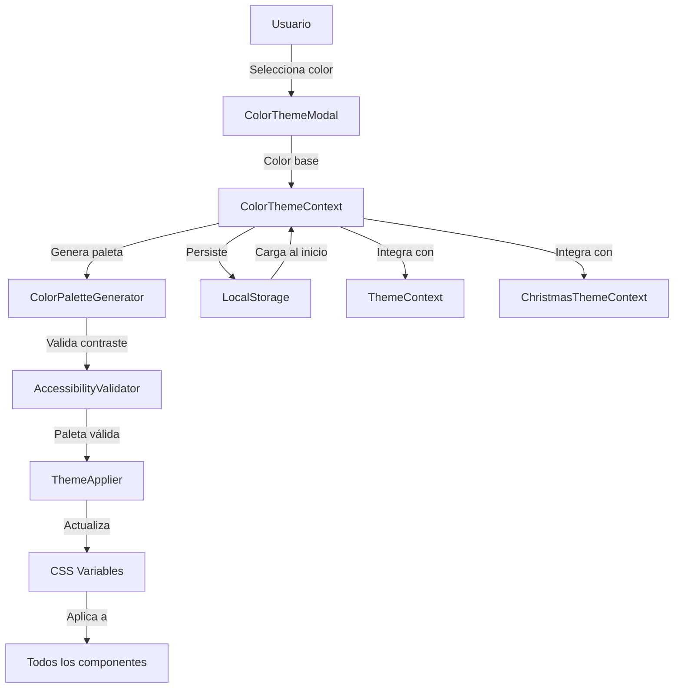

# Design Document: Custom Color Theme System

## Overview

El sistema de temas de color personalizables permite a los usuarios seleccionar un color base y aplicar automáticamente una paleta de colores coherente y accesible a toda la interfaz de la aplicación. El sistema utiliza CSS Variables para aplicación dinámica, React Context para gestión de estado, y localStorage para persistencia.

**Bibliotecas principales:**
- **react-colorful**: Color picker ligero (2.5KB), rápido y accesible
- **chroma-js**: Manipulación y conversión de colores (13.5KB)
- Ambas bibliotecas son zero-dependency y ampliamente utilizadas

## Architecture



### Flujo de datos:

1. Usuario selecciona color en ColorThemeModal
2. ColorThemeContext recibe el color base
3. ColorPaletteGenerator genera paleta completa
4. AccessibilityValidator verifica contrastes WCAG
5. ThemeApplier actualiza CSS Variables
6. Componentes React re-renderizan con nuevos colores
7. LocalStorage persiste la configuración

## Components and Interfaces

### 1. ColorThemeContext

**Responsabilidad:** Gestionar el estado global del tema de color

```javascript
// src/context/ColorThemeContext.jsx
interface ColorTheme {
  baseColor: string;           // Color base seleccionado (hex)
  palette: {
    primary: string;           // Color primario
    primaryLight: string;      // Variante clara del primario
    primaryDark: string;       // Variante oscura del primario
    secondary: string;         // Color secundario (complementario)
    accent: string;            // Color de acento
    background: string;        // Color de fondo principal
    backgroundAlt: string;     // Color de fondo alternativo
    surface: string;           // Color de superficies (cards, modales)
    textPrimary: string;       // Color de texto principal
    textSecondary: string;     // Color de texto secundario
    border: string;            // Color de bordes
    hover: string;             // Color para estados hover
    success: string;           // Color para estados exitosos
    error: string;             // Color para estados de error
  };
  isDark: boolean;             // Si el tema base es oscuro
}

interface ColorThemeContextValue {
  theme: ColorTheme;
  setBaseColor: (color: string) => void;
  resetTheme: () => void;
  isLoading: boolean;
}
```

**Métodos:**
- `setBaseColor(color)`: Genera nueva paleta y actualiza el tema
- `resetTheme()`: Restaura el tema por defecto
- `loadThemeFromStorage()`: Carga tema guardado al iniciar

### 2. ColorPaletteGenerator

**Responsabilidad:** Generar paleta de colores armoniosa a partir de un color base

```javascript
// src/utils/colorPaletteGenerator.js
import chroma from 'chroma-js';

class ColorPaletteGenerator {
  /**
   * Genera una paleta completa a partir de un color base
   * @param {string} baseColor - Color en formato hex, rgb, o hsl
   * @returns {Object} Paleta de colores
   */
  generatePalette(baseColor) {
    const base = chroma(baseColor);
    const isDark = base.luminance() < 0.5;
    
    return {
      primary: base.hex(),
      primaryLight: base.brighten(1).hex(),
      primaryDark: base.darken(1).hex(),
      secondary: this.getComplementary(base).hex(),
      accent: this.getTriadic(base)[0].hex(),
      background: isDark ? '#1a1a1a' : '#ffffff',
      backgroundAlt: isDark ? '#2d2d2d' : '#f5f5f5',
      surface: isDark ? '#242424' : '#ffffff',
      textPrimary: isDark ? '#ffffff' : '#1a1a1a',
      textSecondary: isDark ? '#b0b0b0' : '#666666',
      border: isDark ? '#404040' : '#e0e0e0',
      hover: base.brighten(0.5).hex(),
      success: '#10b981',
      error: '#ef4444'
    };
  }

  /**
   * Obtiene el color complementario (180° en el círculo cromático)
   */
  getComplementary(color) {
    const [h, s, l] = color.hsl();
    return chroma.hsl((h + 180) % 360, s, l);
  }

  /**
   * Obtiene colores triádicos (120° de separación)
   */
  getTriadic(color) {
    const [h, s, l] = color.hsl();
    return [
      chroma.hsl((h + 120) % 360, s, l),
      chroma.hsl((h + 240) % 360, s, l)
    ];
  }

  /**
   * Genera escala de tonos (shades) del color
   */
  generateShades(color, steps = 5) {
    return chroma.scale([color, 'black'])
      .mode('lab')
      .colors(steps);
  }

  /**
   * Genera escala de tintes (tints) del color
   */
  generateTints(color, steps = 5) {
    return chroma.scale([color, 'white'])
      .mode('lab')
      .colors(steps);
  }
}
```

### 3. AccessibilityValidator

**Responsabilidad:** Validar que los colores cumplan con estándares WCAG

```javascript
// src/utils/accessibilityValidator.js
import chroma from 'chroma-js';

class AccessibilityValidator {
  /**
   * Calcula el ratio de contraste entre dos colores
   * @param {string} foreground - Color de primer plano
   * @param {string} background - Color de fondo
   * @returns {number} Ratio de contraste (1-21)
   */
  getContrastRatio(foreground, background) {
    const fg = chroma(foreground);
    const bg = chroma(background);
    return chroma.contrast(fg, bg);
  }

  /**
   * Verifica si el contraste cumple con WCAG AA (4.5:1 para texto normal)
   */
  meetsWCAG_AA(foreground, background) {
    return this.getContrastRatio(foreground, background) >= 4.5;
  }

  /**
   * Verifica si el contraste cumple con WCAG AAA (7:1 para texto normal)
   */
  meetsWCAG_AAA(foreground, background) {
    return this.getContrastRatio(foreground, background) >= 7.0;
  }

  /**
   * Ajusta el color de texto para cumplir con WCAG AA
   * @param {string} textColor - Color de texto inicial
   * @param {string} backgroundColor - Color de fondo
   * @returns {string} Color de texto ajustado
   */
  adjustTextColorForContrast(textColor, backgroundColor) {
    let adjusted = chroma(textColor);
    const bg = chroma(backgroundColor);
    let ratio = chroma.contrast(adjusted, bg);
    
    // Si ya cumple, retornar
    if (ratio >= 4.5) return adjusted.hex();
    
    // Intentar oscurecer o aclarar hasta cumplir
    const isDarkBg = bg.luminance() < 0.5;
    let iterations = 0;
    const maxIterations = 20;
    
    while (ratio < 4.5 && iterations < maxIterations) {
      adjusted = isDarkBg ? adjusted.brighten(0.2) : adjusted.darken(0.2);
      ratio = chroma.contrast(adjusted, bg);
      iterations++;
    }
    
    // Si no se logra, usar blanco o negro
    if (ratio < 4.5) {
      return isDarkBg ? '#ffffff' : '#000000';
    }
    
    return adjusted.hex();
  }

  /**
   * Valida toda una paleta de colores
   */
  validatePalette(palette) {
    const issues = [];
    
    // Validar texto primario sobre fondo
    if (!this.meetsWCAG_AA(palette.textPrimary, palette.background)) {
      issues.push({
        type: 'contrast',
        severity: 'high',
        message: 'Text primary does not meet WCAG AA on background',
        colors: [palette.textPrimary, palette.background]
      });
    }
    
    // Validar texto secundario sobre fondo
    if (!this.meetsWCAG_AA(palette.textSecondary, palette.background)) {
      issues.push({
        type: 'contrast',
        severity: 'medium',
        message: 'Text secondary does not meet WCAG AA on background',
        colors: [palette.textSecondary, palette.background]
      });
    }
    
    // Validar primario sobre fondo (para botones)
    const primaryContrast = this.getContrastRatio(palette.primary, palette.background);
    if (primaryContrast < 3.0) {
      issues.push({
        type: 'contrast',
        severity: 'medium',
        message: 'Primary color has low contrast with background',
        colors: [palette.primary, palette.background]
      });
    }
    
    return {
      isValid: issues.length === 0,
      issues
    };
  }
}
```

### 4. ThemeApplier

**Responsabilidad:** Aplicar la paleta de colores a CSS Variables

```javascript
// src/utils/themeApplier.js
class ThemeApplier {
  /**
   * Aplica la paleta de colores al DOM mediante CSS Variables
   * @param {Object} palette - Paleta de colores a aplicar
   */
  applyTheme(palette) {
    const root = document.documentElement;
    
    // Aplicar cada color como CSS variable
    root.style.setProperty('--color-primary', palette.primary);
    root.style.setProperty('--color-primary-light', palette.primaryLight);
    root.style.setProperty('--color-primary-dark', palette.primaryDark);
    root.style.setProperty('--color-secondary', palette.secondary);
    root.style.setProperty('--color-accent', palette.accent);
    root.style.setProperty('--color-background', palette.background);
    root.style.setProperty('--color-background-alt', palette.backgroundAlt);
    root.style.setProperty('--color-surface', palette.surface);
    root.style.setProperty('--color-text-primary', palette.textPrimary);
    root.style.setProperty('--color-text-secondary', palette.textSecondary);
    root.style.setProperty('--color-border', palette.border);
    root.style.setProperty('--color-hover', palette.hover);
    root.style.setProperty('--color-success', palette.success);
    root.style.setProperty('--color-error', palette.error);
    
    // Agregar clase para transiciones suaves
    root.classList.add('theme-transitioning');
    setTimeout(() => {
      root.classList.remove('theme-transitioning');
    }, 300);
  }

  /**
   * Obtiene los valores actuales de las CSS Variables
   */
  getCurrentTheme() {
    const root = document.documentElement;
    const style = getComputedStyle(root);
    
    return {
      primary: style.getPropertyValue('--color-primary').trim(),
      primaryLight: style.getPropertyValue('--color-primary-light').trim(),
      primaryDark: style.getPropertyValue('--color-primary-dark').trim(),
      secondary: style.getPropertyValue('--color-secondary').trim(),
      accent: style.getPropertyValue('--color-accent').trim(),
      background: style.getPropertyValue('--color-background').trim(),
      backgroundAlt: style.getPropertyValue('--color-background-alt').trim(),
      surface: style.getPropertyValue('--color-surface').trim(),
      textPrimary: style.getPropertyValue('--color-text-primary').trim(),
      textSecondary: style.getPropertyValue('--color-text-secondary').trim(),
      border: style.getPropertyValue('--color-border').trim(),
      hover: style.getPropertyValue('--color-hover').trim(),
      success: style.getPropertyValue('--color-success').trim(),
      error: style.getPropertyValue('--color-error').trim()
    };
  }
}
```

### 5. ColorThemeModal

**Responsabilidad:** Interfaz de usuario para selección de color

```javascript
// src/components/ColorThemeModal.jsx
import { HexColorPicker } from 'react-colorful';
import { useColorTheme } from '../context/ColorThemeContext';

const PRESET_COLORS = [
  '#3b82f6', // Blue
  '#8b5cf6', // Purple
  '#ec4899', // Pink
  '#ef4444', // Red
  '#f59e0b', // Orange
  '#10b981', // Green
  '#06b6d4', // Cyan
  '#6366f1', // Indigo
];

function ColorThemeModal({ isOpen, onClose }) {
  const { theme, setBaseColor, resetTheme } = useColorTheme();
  const [selectedColor, setSelectedColor] = useState(theme.baseColor);
  const [previewPalette, setPreviewPalette] = useState(null);

  // Generar vista previa al cambiar color
  useEffect(() => {
    const generator = new ColorPaletteGenerator();
    const palette = generator.generatePalette(selectedColor);
    setPreviewPalette(palette);
  }, [selectedColor]);

  const handleApply = () => {
    setBaseColor(selectedColor);
    onClose();
  };

  return (
    <Modal isOpen={isOpen} onClose={onClose}>
      <div className="color-theme-modal">
        <h2>Personalizar Tema de Color</h2>
        
        {/* Color Picker */}
        <div className="color-picker-section">
          <HexColorPicker 
            color={selectedColor} 
            onChange={setSelectedColor}
          />
          
          {/* Input manual */}
          <input
            type="text"
            value={selectedColor}
            onChange={(e) => setSelectedColor(e.target.value)}
            placeholder="#3b82f6"
            pattern="^#[0-9A-Fa-f]{6}$"
          />
        </div>

        {/* Colores predefinidos */}
        <div className="preset-colors">
          <h3>Colores Populares</h3>
          <div className="preset-grid">
            {PRESET_COLORS.map(color => (
              <button
                key={color}
                className="preset-color-btn"
                style={{ backgroundColor: color }}
                onClick={() => setSelectedColor(color)}
                aria-label={`Seleccionar color ${color}`}
              />
            ))}
          </div>
        </div>

        {/* Vista previa de la paleta */}
        {previewPalette && (
          <div className="palette-preview">
            <h3>Vista Previa</h3>
            <div className="preview-grid">
              <div style={{ backgroundColor: previewPalette.primary }}>
                Primario
              </div>
              <div style={{ backgroundColor: previewPalette.secondary }}>
                Secundario
              </div>
              <div style={{ backgroundColor: previewPalette.accent }}>
                Acento
              </div>
              <div style={{ 
                backgroundColor: previewPalette.background,
                color: previewPalette.textPrimary 
              }}>
                Fondo con texto
              </div>
            </div>
          </div>
        )}

        {/* Botones de acción */}
        <div className="modal-actions">
          <button onClick={resetTheme}>
            Restablecer por defecto
          </button>
          <button onClick={onClose}>
            Cancelar
          </button>
          <button onClick={handleApply} className="primary">
            Aplicar
          </button>
        </div>
      </div>
    </Modal>
  );
}
```

### 6. Botón de acceso en Navbar

```javascript
// Agregar a src/components/Navbar.jsx
import { useState } from 'react';
import ColorThemeModal from './ColorThemeModal';

// Dentro del componente Navbar:
const [showColorTheme, setShowColorTheme] = useState(false);

// En el JSX, agregar botón:
<button
  onClick={() => setShowColorTheme(true)}
  className="theme-button"
  aria-label="Personalizar colores"
>
  <PaletteIcon />
</button>

<ColorThemeModal 
  isOpen={showColorTheme} 
  onClose={() => setShowColorTheme(false)} 
/>
```

## Data Models

### ColorTheme Storage Model

```javascript
// Estructura guardada en localStorage
{
  "version": "1.0",
  "baseColor": "#3b82f6",
  "palette": {
    "primary": "#3b82f6",
    "primaryLight": "#60a5fa",
    "primaryDark": "#2563eb",
    // ... resto de colores
  },
  "isDark": false,
  "timestamp": 1703001234567
}
```

### CSS Variables Mapping

```css
/* src/index.css - Variables por defecto */
:root {
  /* Colores del tema personalizable */
  --color-primary: #3b82f6;
  --color-primary-light: #60a5fa;
  --color-primary-dark: #2563eb;
  --color-secondary: #8b5cf6;
  --color-accent: #ec4899;
  --color-background: #ffffff;
  --color-background-alt: #f5f5f5;
  --color-surface: #ffffff;
  --color-text-primary: #1a1a1a;
  --color-text-secondary: #666666;
  --color-border: #e0e0e0;
  --color-hover: #60a5fa;
  --color-success: #10b981;
  --color-error: #ef4444;
  
  /* Transiciones suaves al cambiar tema */
  --theme-transition: all 0.3s ease;
}

.theme-transitioning * {
  transition: var(--theme-transition) !important;
}

/* Aplicar variables a componentes existentes */
.navbar {
  background-color: var(--color-surface);
  border-bottom: 1px solid var(--color-border);
}

.btn-primary {
  background-color: var(--color-primary);
  color: white;
}

.btn-primary:hover {
  background-color: var(--color-hover);
}

.card {
  background-color: var(--color-surface);
  border: 1px solid var(--color-border);
  color: var(--color-text-primary);
}

.modal {
  background-color: var(--color-surface);
  color: var(--color-text-primary);
}

/* Y así sucesivamente para todos los componentes */
```

## Correctness Properties

*Una propiedad es una característica o comportamiento que debe mantenerse verdadero en todas las ejecuciones válidas del sistema - esencialmente, una declaración formal sobre lo que el sistema debe hacer. Las propiedades sirven como puente entre las especificaciones legibles por humanos y las garantías de corrección verificables por máquina.*


### Propiedades de Corrección

**Property 1: Color capture format consistency**
*For any* color selected by the user (whether through visual picker, hex input, or RGB input), the captured value should be convertible to a valid hexadecimal format.
**Validates: Requirements 1.2, 1.3**

**Property 2: Palette generation completeness**
*For any* base color provided, the generated palette should contain all required fields: primary, primaryLight, primaryDark, secondary, accent, background, backgroundAlt, surface, textPrimary, textSecondary, border, hover, success, and error.
**Validates: Requirements 2.5**

**Property 3: Complementary color correctness**
*For any* base color with hue H, the generated complementary color should have hue (H + 180) % 360 in the HSL color space.
**Validates: Requirements 2.2**

**Property 4: Luminance variation in shades**
*For any* base color, the generated primaryLight variant should have higher luminance than the base, and primaryDark should have lower luminance than the base.
**Validates: Requirements 2.1**

**Property 5: WCAG AA contrast compliance**
*For any* generated palette, the contrast ratio between textPrimary and background should be at least 4.5:1, and between textSecondary and background should be at least 4.5:1.
**Validates: Requirements 2.4, 2.6**

**Property 6: RGB value validity**
*For any* color in a generated palette, when converted to RGB format, all three components (R, G, B) should be integers in the range [0, 255].
**Validates: Requirements 7.4**

**Property 7: CSS variables update propagation**
*For any* palette applied to the system, all corresponding CSS variables (--color-primary, --color-secondary, etc.) should be updated to match the palette values.
**Validates: Requirements 3.2**

**Property 8: Theme context synchronization**
*For any* theme change, the ColorThemeContext should be updated to reflect the new theme before any components re-render.
**Validates: Requirements 3.5**

**Property 9: Theme persistence round-trip**
*For any* valid theme saved to localStorage, loading the theme from storage should produce an equivalent theme object (same baseColor and palette values).
**Validates: Requirements 4.1, 4.2**

**Property 10: Storage data structure validation**
*For any* theme stored in localStorage, it should contain both a baseColor field and a palette object with all required color properties.
**Validates: Requirements 4.5**

**Property 11: Invalid color rejection**
*For any* invalid color input (malformed hex, out-of-range RGB, corrupted data), the system should reject the input and maintain the current theme unchanged.
**Validates: Requirements 7.2, 7.3**

**Property 12: Error input validation**
*For any* invalid color code entered by the user, the system should display an error message and not apply the invalid color.
**Validates: Requirements 7.1**

**Property 13: Corrupted storage recovery**
*For any* corrupted or invalid data in localStorage, the system should clear the storage and apply the default theme without crashing.
**Validates: Requirements 7.3, 7.5**

**Property 14: Theme mode adaptation**
*For any* base color, when dark mode is active the generated background should have luminance < 0.3, and when light mode is active the background should have luminance > 0.7.
**Validates: Requirements 5.1, 5.2**

**Property 15: Real-time preview update**
*For any* color change in the picker, the preview palette should update to reflect the new color within the same render cycle.
**Validates: Requirements 1.4**

**Property 16: Current color display**
*For any* active theme, when the color picker modal is opened, the picker should display the current baseColor as the selected color.
**Validates: Requirements 6.3**

**Property 17: Theme persistence after modal close**
*For any* theme applied while the modal is open, closing the modal should not revert the theme changes.
**Validates: Requirements 6.5**

## Error Handling

### Input Validation Errors

**Invalid Color Format:**
- Detectar formatos inválidos usando regex y chroma.js validation
- Mostrar mensaje: "Color inválido. Use formato hexadecimal (#RRGGBB) o RGB (rgb(r,g,b))"
- Mantener el color anterior sin cambios

**Out of Range Values:**
- Validar que RGB esté en [0, 255]
- Validar que HSL hue esté en [0, 360], saturation y lightness en [0, 100]
- Rechazar valores fuera de rango

### Storage Errors

**Corrupted localStorage Data:**
```javascript
try {
  const stored = JSON.parse(localStorage.getItem('colorTheme'));
  if (!isValidThemeStructure(stored)) {
    throw new Error('Invalid theme structure');
  }
  return stored;
} catch (error) {
  console.error('Failed to load theme from storage:', error);
  localStorage.removeItem('colorTheme');
  return getDefaultTheme();
}
```

**Storage Quota Exceeded:**
- Capturar QuotaExceededError
- Limpiar datos antiguos o innecesarios
- Notificar al usuario si es necesario

### Generation Errors

**Palette Generation Failure:**
```javascript
try {
  const palette = generator.generatePalette(baseColor);
  const validation = validator.validatePalette(palette);
  
  if (!validation.isValid) {
    console.warn('Palette validation issues:', validation.issues);
    // Ajustar colores problemáticos
    palette.textPrimary = validator.adjustTextColorForContrast(
      palette.textPrimary, 
      palette.background
    );
  }
  
  return palette;
} catch (error) {
  console.error('Palette generation failed:', error);
  return getDefaultPalette();
}
```

**Contrast Adjustment Failure:**
- Si no se puede lograr contraste suficiente después de 20 iteraciones
- Usar blanco (#ffffff) o negro (#000000) como fallback
- Registrar warning en consola

### Context Errors

**Theme Context Not Available:**
```javascript
export function useColorTheme() {
  const context = useContext(ColorThemeContext);
  if (!context) {
    throw new Error(
      'useColorTheme must be used within ColorThemeProvider'
    );
  }
  return context;
}
```

**Concurrent Theme Updates:**
- Usar debouncing para evitar múltiples actualizaciones simultáneas
- Aplicar solo la última actualización si hay múltiples en cola

## Testing Strategy

### Dual Testing Approach

El sistema utilizará tanto **unit tests** como **property-based tests** para garantizar corrección completa:

- **Unit tests**: Verifican casos específicos, ejemplos concretos, y comportamientos de UI
- **Property tests**: Verifican propiedades universales que deben cumplirse para todos los inputs

Ambos tipos de tests son complementarios y necesarios.

### Property-Based Testing

**Framework:** Utilizaremos **fast-check** para JavaScript/React, que es la biblioteca estándar para property-based testing en el ecosistema JavaScript.

**Configuración:**
- Mínimo 100 iteraciones por test de propiedad
- Cada test debe referenciar su propiedad del documento de diseño
- Formato de tag: `// Feature: custom-color-theme, Property N: [descripción]`

**Generadores personalizados:**

```javascript
// Generador de colores hexadecimales válidos
const hexColorArb = fc.hexaString({ minLength: 6, maxLength: 6 })
  .map(hex => `#${hex}`);

// Generador de colores RGB válidos
const rgbColorArb = fc.record({
  r: fc.integer({ min: 0, max: 255 }),
  g: fc.integer({ min: 0, max: 255 }),
  b: fc.integer({ min: 0, max: 255 })
}).map(({ r, g, b }) => `rgb(${r},${g},${b})`);

// Generador de colores HSL válidos
const hslColorArb = fc.record({
  h: fc.integer({ min: 0, max: 360 }),
  s: fc.integer({ min: 0, max: 100 }),
  l: fc.integer({ min: 0, max: 100 })
}).map(({ h, s, l }) => `hsl(${h},${s}%,${l}%)`);

// Generador de colores inválidos
const invalidColorArb = fc.oneof(
  fc.constant('not-a-color'),
  fc.constant('#GGGGGG'),
  fc.constant('rgb(300,300,300)'),
  fc.constant('#12'),
  fc.constant(''),
  fc.constant(null)
);

// Generador de datos de localStorage corruptos
const corruptedStorageArb = fc.oneof(
  fc.constant('invalid json'),
  fc.constant('{"incomplete": true}'),
  fc.constant('{"baseColor": "invalid"}'),
  fc.object() // Objeto aleatorio sin estructura correcta
);
```

**Ejemplos de tests de propiedades:**

```javascript
// Property 5: WCAG AA contrast compliance
test('Property 5: Generated palettes meet WCAG AA contrast', () => {
  fc.assert(
    fc.property(hexColorArb, (baseColor) => {
      const generator = new ColorPaletteGenerator();
      const palette = generator.generatePalette(baseColor);
      const validator = new AccessibilityValidator();
      
      const textPrimaryContrast = validator.getContrastRatio(
        palette.textPrimary,
        palette.background
      );
      const textSecondaryContrast = validator.getContrastRatio(
        palette.textSecondary,
        palette.background
      );
      
      return textPrimaryContrast >= 4.5 && textSecondaryContrast >= 4.5;
    }),
    { numRuns: 100 }
  );
});

// Property 9: Theme persistence round-trip
test('Property 9: Save and load preserves theme', () => {
  fc.assert(
    fc.property(hexColorArb, (baseColor) => {
      const generator = new ColorPaletteGenerator();
      const originalTheme = {
        baseColor,
        palette: generator.generatePalette(baseColor)
      };
      
      // Simular guardado y carga
      const serialized = JSON.stringify(originalTheme);
      const loaded = JSON.parse(serialized);
      
      return loaded.baseColor === originalTheme.baseColor &&
             loaded.palette.primary === originalTheme.palette.primary;
    }),
    { numRuns: 100 }
  );
});

// Property 11: Invalid color rejection
test('Property 11: Invalid colors are rejected', () => {
  fc.assert(
    fc.property(invalidColorArb, (invalidColor) => {
      const generator = new ColorPaletteGenerator();
      const currentTheme = generator.generatePalette('#3b82f6');
      
      try {
        generator.generatePalette(invalidColor);
        return false; // No debería llegar aquí
      } catch (error) {
        // Verificar que el tema actual no cambió
        return true;
      }
    }),
    { numRuns: 100 }
  );
});
```

### Unit Testing

**Framework:** Vitest + React Testing Library

**Casos a testear:**

1. **Renderizado de componentes:**
   - ColorThemeModal se renderiza correctamente
   - Botón de tema aparece en Navbar
   - Colores predefinidos se muestran

2. **Interacciones de usuario:**
   - Click en botón abre modal
   - Selección de color predefinido actualiza el picker
   - Click en "Aplicar" cierra modal y aplica tema
   - Click en "Restablecer" vuelve al tema por defecto

3. **Edge cases:**
   - localStorage vacío al iniciar
   - Entrada de color inválido muestra error
   - Cerrar modal sin aplicar no cambia el tema

4. **Integración:**
   - Tema se aplica a componentes existentes (Navbar, Cards, Modales)
   - Compatibilidad con ThemeContext (modo oscuro/claro)
   - Compatibilidad con ChristmasThemeContext

**Ejemplo de unit test:**

```javascript
import { render, screen, fireEvent } from '@testing-library/react';
import { ColorThemeProvider } from '../context/ColorThemeContext';
import ColorThemeModal from '../components/ColorThemeModal';

describe('ColorThemeModal', () => {
  test('displays preset colors', () => {
    render(
      <ColorThemeProvider>
        <ColorThemeModal isOpen={true} onClose={() => {}} />
      </ColorThemeProvider>
    );
    
    const presetButtons = screen.getAllByRole('button', { 
      name: /Seleccionar color/ 
    });
    expect(presetButtons).toHaveLength(8);
  });

  test('applies theme when clicking Apply button', () => {
    const onClose = jest.fn();
    render(
      <ColorThemeProvider>
        <ColorThemeModal isOpen={true} onClose={onClose} />
      </ColorThemeProvider>
    );
    
    const applyButton = screen.getByText('Aplicar');
    fireEvent.click(applyButton);
    
    expect(onClose).toHaveBeenCalled();
    // Verificar que CSS variables fueron actualizadas
    const root = document.documentElement;
    const primaryColor = getComputedStyle(root)
      .getPropertyValue('--color-primary');
    expect(primaryColor).toBeTruthy();
  });

  test('shows error for invalid hex input', () => {
    render(
      <ColorThemeProvider>
        <ColorThemeModal isOpen={true} onClose={() => {}} />
      </ColorThemeProvider>
    );
    
    const input = screen.getByPlaceholderText('#3b82f6');
    fireEvent.change(input, { target: { value: 'invalid' } });
    
    expect(screen.getByText(/Color inválido/i)).toBeInTheDocument();
  });
});
```

### Test Coverage Goals

- **Cobertura de código:** Mínimo 80% para lógica de negocio
- **Cobertura de propiedades:** Todas las 17 propiedades deben tener tests
- **Cobertura de UI:** Todos los componentes nuevos deben tener tests de renderizado
- **Cobertura de integración:** Verificar compatibilidad con sistemas existentes

### Continuous Testing

- Ejecutar tests en cada commit (pre-commit hook)
- Ejecutar property tests en CI/CD con 1000 iteraciones
- Monitorear performance de generación de paletas
- Validar accesibilidad con herramientas automatizadas (axe-core)

## Implementation Notes

### Dependencies to Install

```json
{
  "dependencies": {
    "react-colorful": "^5.6.1",
    "chroma-js": "^2.4.2"
  },
  "devDependencies": {
    "fast-check": "^3.15.0",
    "@testing-library/react": "^14.1.2",
    "@testing-library/user-event": "^14.5.1",
    "vitest": "^1.1.0"
  }
}
```

### CSS Architecture

Utilizar CSS Variables para máxima flexibilidad:
- Todas las propiedades de color deben usar `var(--color-*)` 
- Evitar colores hardcodeados en componentes
- Usar transiciones CSS para cambios suaves
- Considerar `prefers-color-scheme` para tema inicial

### Performance Considerations

- Debounce de actualizaciones de color (300ms) para evitar re-renders excesivos
- Memoizar paletas generadas con `useMemo`
- Lazy load del ColorThemeModal
- Optimizar cálculos de contraste (cachear resultados)

### Accessibility Considerations

- Color picker debe ser navegable por teclado
- Incluir labels ARIA apropiados
- Anunciar cambios de tema a screen readers
- Mantener contraste mínimo WCAG AA en todo momento
- Proporcionar alternativas visuales además del color

### Browser Compatibility

- CSS Variables: Soportado en todos los navegadores modernos
- localStorage: Verificar disponibilidad antes de usar
- Fallback para navegadores sin soporte de CSS Variables (muy raro)

### Migration Strategy

1. Agregar CSS Variables sin cambiar colores existentes
2. Actualizar componentes gradualmente para usar variables
3. Implementar ColorThemeContext y provider
4. Agregar UI de selección de color
5. Habilitar persistencia en localStorage
6. Testing exhaustivo en todos los componentes
