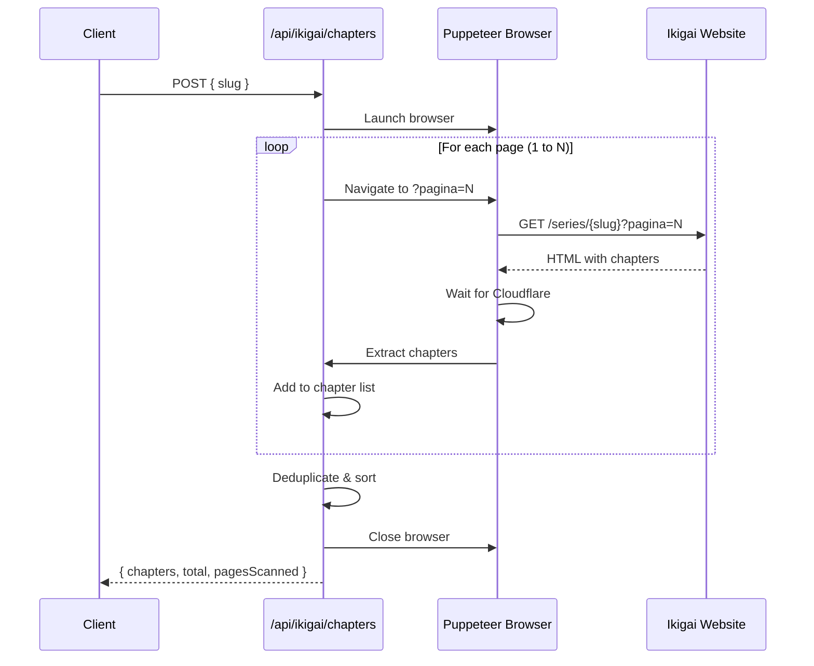

# Design Document: Ikigai Chapter Pagination

## Overview

Este diseño implementa un sistema de extracción completa de capítulos para Ikigai mediante navegación automática por páginas paginadas. El sistema reemplazará el enfoque actual de scroll infinito con un enfoque basado en paginación URL, navegando secuencialmente por URLs con el parámetro `?pagina=N` para obtener todos los capítulos de una obra.

La solución se implementará modificando el endpoint existente `/api/ikigai/chapters` para que detecte automáticamente el número total de páginas, navegue por cada una, extraiga los capítulos, y retorne una lista consolidada y deduplicada.

## Architecture

### High-Level Flow

```
┌─────────────────┐
│  Client Request │
│   (slug)        │
└────────┬────────┘
         │
         ▼
┌─────────────────────────────────────────┐
│  Chapter Extraction Orchestrator        │
│  1. Launch Browser                      │
│  2. Navigate to page 1                  │
│  3. Detect total pages                  │
│  4. Loop through all pages              │
│  5. Consolidate & deduplicate           │
│  6. Return results                      │
└────────┬────────────────────────────────┘
         │
         ▼
┌─────────────────────────────────────────┐
│  Response                               │
│  { chapters, total, pagesScanned }      │
└─────────────────────────────────────────┘
```

### Component Interaction



## Components and Interfaces

### 1. Main Handler Function

**Responsibility**: Orquestar todo el proceso de extracción

**Interface**:
```javascript
async function handler(req, res)
```

**Input**:
- `req.body.slug`: String - Identificador de la obra

**Output**:
- Success (200): `{ chapters: Array, total: Number, pagesScanned: Number }`
- Error (500): `{ error: String, details: String }`

### 2. Pagination Detector

**Responsibility**: Detectar el número total de páginas de capítulos

**Interface**:
```javascript
async function detectTotalPages(page)
```

**Input**:
- `page`: Puppeteer Page object

**Output**:
- `Number`: Total de páginas (mínimo 1)

**Logic**:
1. Buscar elementos de paginación en el DOM
2. Extraer el número de la última página
3. Si no se encuentra paginación, retornar 1
4. Validar que el número esté entre 1 y 100

**Selectors to try** (in order):
- `a[href*="pagina="]` - Enlaces con parámetro pagina
- `.pagination a`, `[class*="pagination"] a` - Enlaces dentro de controles de paginación
- Botones con texto "Última", "Last", números
- Extraer el número más alto de todos los enlaces encontrados

### 3. Chapter Extractor

**Responsibility**: Extraer capítulos de una página específica

**Interface**:
```javascript
async function extractChaptersFromPage(page)
```

**Input**:
- `page`: Puppeteer Page object

**Output**:
- `Array<Chapter>`: Lista de capítulos encontrados

**Chapter Structure**:
```javascript
{
  chapter: String,  // Número del capítulo (ej: "91", "45.5")
  title: String,    // Título del capítulo
  url: String       // URL completa del capítulo
}
```

**Logic**:
1. Buscar todos los enlaces `<a>` en la página
2. Filtrar enlaces que contengan `/capitulo/` en el href
3. Para cada enlace:
   - Extraer número de capítulo del texto o URL
   - Extraer título del texto del enlace
   - Construir URL completa
4. Validar que el número de capítulo sea válido (0-9999)
5. Retornar array de capítulos

### 4. Cloudflare Challenge Handler

**Responsibility**: Esperar y verificar que el challenge de Cloudflare se complete

**Interface**:
```javascript
async function waitForCloudflareChallenge(page, timeout = 20000)
```

**Input**:
- `page`: Puppeteer Page object
- `timeout`: Number - Tiempo máximo de espera en ms

**Output**:
- `Boolean`: true si el challenge se completó, false si falló

**Logic**:
1. Usar `page.waitForFunction()` para esperar condiciones:
   - Título no contiene "500", "Just a moment", "Error"
   - Body no contiene "Checking your browser"
   - Body tiene contenido (length > 100)
2. Si timeout, intentar reload una vez
3. Esperar 3 segundos adicionales para renderizado
4. Retornar resultado

### 5. Chapter Consolidator

**Responsibility**: Consolidar, deduplicar y ordenar capítulos

**Interface**:
```javascript
function consolidateChapters(allChapters)
```

**Input**:
- `allChapters`: Array<Array<Chapter>> - Array de arrays de capítulos (uno por página)

**Output**:
- `Array<Chapter>`: Lista consolidada, deduplicada y ordenada

**Logic**:
1. Flatten: Combinar todos los arrays en uno solo
2. Deduplicate: Usar Map con `chapter` como key, preservar primera ocurrencia
3. Sort: Ordenar por número de capítulo descendente (mayor a menor)
4. Retornar array final

## Data Models

### Chapter

```javascript
{
  chapter: String,     // "91", "45.5", "1"
  title: String,       // "Capítulo 91" o título personalizado
  url: String          // "https://viralikigai.foodib.net/capitulo/12345/"
}
```

### API Response

```javascript
{
  chapters: Array<Chapter>,  // Lista de capítulos
  total: Number,             // Total de capítulos únicos
  pagesScanned: Number       // Número de páginas procesadas
}
```

### Error Response

```javascript
{
  error: String,    // Mensaje de error general
  details: String   // Detalles técnicos del error
}
```

## Correctness Properties

*Una propiedad es una característica o comportamiento que debe mantenerse verdadero en todas las ejecuciones válidas del sistema - esencialmente, una declaración formal sobre lo que el sistema debe hacer.*

### Property 1: Pagination Detection and Extraction
*For any* HTML page content, when pagination controls are present, the system should correctly extract the total number of pages, and when pagination controls are absent, the system should return 1 as the total number of pages.
**Validates: Requirements 1.1, 1.2, 1.3**

### Property 2: Page Number Validation
*For any* extracted page number, the system should only accept values that are positive integers between 1 and 100, rejecting any values outside this range.
**Validates: Requirements 1.4**

### Property 3: Sequential URL Construction
*For any* sequence of page numbers from 1 to N, the system should construct URLs with the correct format `{baseUrl}?pagina={pageNumber}` for each page number in the sequence.
**Validates: Requirements 2.2, 2.3**

### Property 4: Error Recovery During Navigation
*For any* page that fails to load, the system should log the error and continue processing the next page without stopping the entire extraction process.
**Validates: Requirements 2.5**

### Property 5: Complete Chapter Extraction
*For any* HTML page containing chapter links, the system should extract all chapter links that match the pattern `/capitulo/` and obtain the chapter number, title, and URL for each valid link.
**Validates: Requirements 3.1, 3.2**

### Property 6: Chapter Accumulation
*For any* sequence of pages processed, all extracted chapters should be accumulated into a single list, preserving the order in which they were extracted.
**Validates: Requirements 3.3, 3.4**

### Property 7: Invalid Chapter Filtering
*For any* chapter link without a valid chapter number (not in range 0-9999), the system should omit that chapter from the results and continue processing other chapters.
**Validates: Requirements 3.5**

### Property 8: Deduplication with First Occurrence Preservation
*For any* list of chapters containing duplicates (same chapter number), the consolidation process should remove all duplicates while preserving only the first occurrence of each unique chapter number.
**Validates: Requirements 4.2, 4.3**

### Property 9: Descending Sort After Consolidation
*For any* consolidated and deduplicated list of chapters, the final list should be sorted by chapter number in descending order (highest to lowest).
**Validates: Requirements 4.4**

### Property 10: Complete Response Structure
*For any* successful extraction, the API response should include a `chapters` array, a `total` count of unique chapters, and a `pagesScanned` count, where each chapter object contains `chapter`, `title`, and `url` fields.
**Validates: Requirements 4.5, 8.2, 8.3**

### Property 11: Valid Content Verification
*For any* page after Cloudflare challenge completion, the system should verify that the page content is valid by checking that the title doesn't contain error keywords and the body has substantial content.
**Validates: Requirements 5.4**

### Property 12: API Request Validation
*For any* request to the `/api/ikigai/chapters` endpoint, the system should accept POST requests with a `slug` parameter in the body, and reject non-POST requests with HTTP 405.
**Validates: Requirements 8.1, 8.5**

## Error Handling

### Error Categories

1. **Navigation Errors**
   - Timeout during page load
   - Cloudflare challenge failure
   - Network errors
   - **Handling**: Log error, attempt reload once, continue to next page if still fails

2. **Extraction Errors**
   - Invalid HTML structure
   - Missing expected elements
   - Malformed chapter data
   - **Handling**: Log error, skip invalid items, continue with valid data

3. **Validation Errors**
   - Invalid slug parameter
   - Invalid HTTP method
   - **Handling**: Return appropriate HTTP error code (400, 405)

4. **System Errors**
   - Browser launch failure
   - Out of memory
   - Unexpected exceptions
   - **Handling**: Log error, close browser if open, return HTTP 500

### Error Response Format

```javascript
{
  error: "Error obteniendo capítulos",
  details: "Specific error message"
}
```

### Retry Strategy

- **Page Load Failures**: Retry once with reload
- **Cloudflare Challenge**: Wait up to 20s, then retry once
- **Extraction Failures**: No retry, skip and continue
- **Browser Failures**: No retry, fail entire request

## Testing Strategy

### Unit Tests

Unit tests will focus on specific examples and edge cases:

1. **Pagination Detection**
   - Example: HTML with pagination controls showing 4 pages
   - Example: HTML without pagination controls (should return 1)
   - Edge case: HTML with malformed pagination

2. **URL Construction**
   - Example: Construct URL for page 1, 2, 3
   - Example: Verify query parameter format

3. **Chapter Extraction**
   - Example: Extract chapters from sample HTML
   - Edge case: HTML with no chapter links
   - Edge case: Chapter links with missing numbers

4. **Consolidation**
   - Example: Consolidate chapters from 3 pages
   - Example: Remove duplicates from list
   - Example: Sort chapters in descending order

5. **API Endpoints**
   - Example: Valid POST request returns 200
   - Example: GET request returns 405
   - Example: Missing slug returns 400

### Property-Based Tests

Property-based tests will verify universal properties across many generated inputs. Each test should run a minimum of 100 iterations.

1. **Property 2: Page Number Validation**
   - Generate random integers (including negative, zero, > 100)
   - Verify only 1-100 are accepted
   - **Tag**: Feature: ikigai-chapter-pagination, Property 2: Page Number Validation

2. **Property 3: Sequential URL Construction**
   - Generate random sequences of page numbers
   - Verify all URLs have correct format
   - **Tag**: Feature: ikigai-chapter-pagination, Property 3: Sequential URL Construction

3. **Property 7: Invalid Chapter Filtering**
   - Generate chapters with valid and invalid numbers
   - Verify only valid chapters (0-9999) are included
   - **Tag**: Feature: ikigai-chapter-pagination, Property 7: Invalid Chapter Filtering

4. **Property 8: Deduplication with First Occurrence Preservation**
   - Generate chapter lists with random duplicates
   - Verify duplicates removed and first occurrence preserved
   - **Tag**: Feature: ikigai-chapter-pagination, Property 8: Deduplication with First Occurrence Preservation

5. **Property 9: Descending Sort After Consolidation**
   - Generate random unsorted chapter lists
   - Verify final list is sorted descending
   - **Tag**: Feature: ikigai-chapter-pagination, Property 9: Descending Sort After Consolidation

### Integration Tests

Integration tests will verify the complete flow with real browser automation:

1. Test complete extraction with a known manga (e.g., Jinx with 4 pages)
2. Verify all chapters from all pages are retrieved
3. Verify no duplicates in final result
4. Verify correct ordering

### Testing Framework

- **Unit Tests**: Jest or Vitest
- **Property-Based Tests**: fast-check (JavaScript property testing library)
- **Integration Tests**: Jest with Puppeteer

## Implementation Notes

### Browser Configuration

```javascript
{
  args: [
    ...chromium.args,
    '--no-sandbox',
    '--disable-setuid-sandbox',
    '--disable-blink-features=AutomationControlled'
  ],
  executablePath: await chromium.executablePath(),
  headless: chromium.headless,
  ignoreHTTPSErrors: true
}
```

### Anti-Detection Measures

```javascript
await page.evaluateOnNewDocument(() => {
  Object.defineProperty(navigator, 'webdriver', { get: () => false });
  window.navigator.chrome = { runtime: {} };
  Object.defineProperty(navigator, 'plugins', { get: () => [1, 2, 3, 4, 5] });
  Object.defineProperty(navigator, 'languages', { get: () => ['en-US', 'en'] });
});
```

### Resource Blocking

Block unnecessary resources to improve performance:
- ads
- analytics
- doubleclick
- tracking

### Timing Considerations

- **Cloudflare Challenge**: Up to 20 seconds
- **Page Render**: 3 seconds after challenge
- **Total per page**: ~25 seconds maximum
- **4 pages**: ~100 seconds total (acceptable for background operation)

## Performance Considerations

### Time Complexity

- **Pagination Detection**: O(n) where n = number of pagination elements
- **Chapter Extraction**: O(m) where m = number of links per page
- **Consolidation**: O(p * m) where p = number of pages
- **Deduplication**: O(p * m) using Map
- **Sorting**: O(k log k) where k = total unique chapters

### Space Complexity

- **Browser Memory**: ~100-200 MB per instance
- **Chapter Storage**: O(p * m) for all chapters
- **Deduplicated Storage**: O(k) for unique chapters

### Optimization Strategies

1. **Reuse Browser Instance**: Single browser for all pages
2. **Reuse Tab**: Single tab navigating between pages
3. **Block Resources**: Reduce network overhead
4. **Minimal Waits**: Only wait when necessary
5. **Early Validation**: Validate slug before launching browser

## Deployment Considerations

### Vercel Serverless Function Limits

- **Timeout**: 10 seconds (Hobby), 60 seconds (Pro)
- **Memory**: 1024 MB default
- **Recommendation**: Upgrade to Pro plan or implement pagination in chunks

### Alternative: Background Job

If extraction takes > 60 seconds:
1. Return immediately with job ID
2. Process in background
3. Client polls for results
4. Store results in temporary cache

### Monitoring

Log key metrics:
- Total extraction time
- Pages processed
- Chapters found
- Errors encountered
- Browser memory usage

